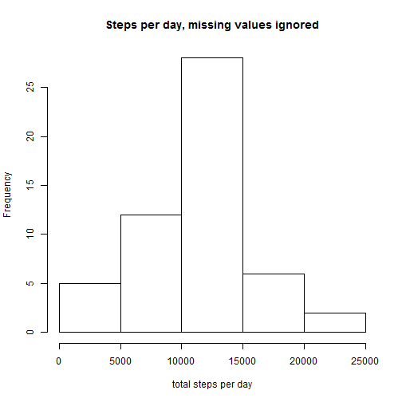
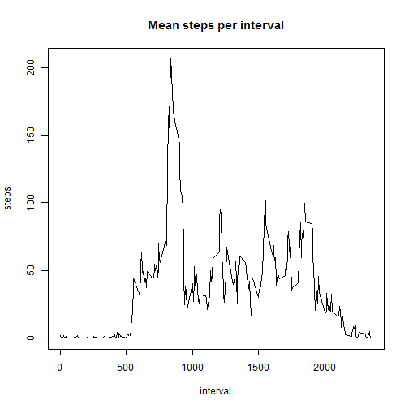
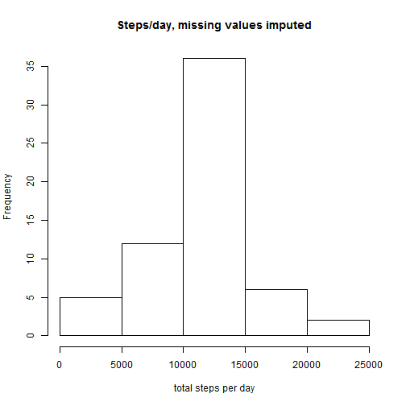
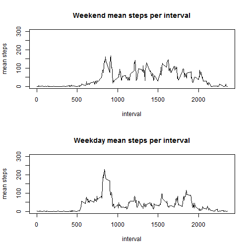

This is a document intended to fulfill the requirements for the first peer assessment for the "Reproducible Research" class.  It is intended to be read in conjunction with the relevant assignment page for that class.  

## Loading and preprocessing the data

The first step in fulfilling this assignment was to load the data, as follows:     


```r
basedata <- read.csv("RepResPA1data.csv")
```

The column intended to represent the date was stored in such a way as to cause sorting errors, so the data were processed by converting that column into date format as follows:  


```r
basedata$date <- as.Date(basedata$date, format ="%m/%d/%Y")
```

No further preprocessing was necessary.  

## What is mean total number of steps taken per day?

This question was answered using tools from the plyr package, as follows:  


```r
library(plyr)
library(dplyr)
stepsperday <- ddply(basedata, c("date"), summarise, steps = sum(steps))
```

The mean and median steps per day were calculated as follows:  


```r
meansteps <- mean(stepsperday$steps, na.rm = TRUE)
medsteps <- median(stepsperday$steps, na.rm = TRUE)
```

The mean number of steps per day, ignoring missing values, is 10766.19;the median is 10765.  

A histogram of the total number of steps taken per day, created using the appended code, appears below.  


```r
hist(stepsperday$steps, xlab = "total steps per day", main = "Steps per day, missing values ignored")
```

 


## What is the average daily activity pattern?

In order to plot the number of steps per interval, averaged over days of the week, it was first necessary to calculate the mean steps per interval.  This was done as follows:  


```r
avstepsperinterval <- ddply(basedata, c("interval"), summarise, steps = mean(steps, na.rm = TRUE))
```

The largest number of mean steps per interval was calculated as follows:  


```r
moststepsperinterval <- avstepsperinterval[which(avstepsperinterval$steps == max(avstepsperinterval$steps)), ]
```

Interval 835 had the largest mean number of steps:  206.1698.  

The code below creates the plot also included below, of average daily activity pattern in terms of steps per interval.  


```r
plot(avstepsperinterval$interval, avstepsperinterval$steps, type="l", ylab = "steps", xlab = "interval", main = "Mean steps per interval")
```

 

## Imputing missing values

Of the two simple imputation strategies suggested on the assignment page, the strategy of replacing NA values with the average value of the interval in question over all days was the more appropriate.  Replacing NA values with the average value of the day in question over all intervals fails to remove all NA values, as some days have no measurements at all.  No intervals have no measurements at all, however, even if some intervals have only measurements whose value is zero.  As such, for purposes of this assignment, all NA values were replaced with the average value of the appropriate interval over all days.  

The following code implements the above imputation strategy.  


```r
#This bit returns the row numbers of the NA values, which will be useful later.
nas <- which(is.na(basedata$steps))

#This bit counts how many NA values there are in the dataset.  
nacount <- length(nas)

#This bit makes a new dataset.
basedataimputed <- basedata

#And this bit imputes missing values.  
for (i in nas) {
  basedataimputed[i, 1] <- avstepsperinterval[which(avstepsperinterval$interval == basedataimputed[i,3]), 2]
}
```

The following code summarizes the total number of steps per day on the imputed-values column of the new file:  


```r
imputedstepsperday <- ddply(basedataimputed, c("date"), summarise, steps = sum(steps))
```

And the following code calculates the mean and median of steps per day, with imputed values included.  


```r
meanimputed <- mean(imputedstepsperday$steps, na.rm = TRUE)
medimputed <- median(imputedstepsperday$steps, na.rm = TRUE)
```

The mean and median values, post-imputation, are both 10766.19.  Thus, this imputation strategy leaves the mean number of steps per day unchanged, and brings the median into alignment with the mean, as expected.  

The code below creates the appended histogram:  


```r
hist(imputedstepsperday$steps, xlab = "total steps per day", main = "Steps/day, missing values imputed")
```

 

## Are there differences in activity patterns between weekdays and weekends?

The following code finds the days of the week and classifies them by a factor variable with levels "Weekend" and "Weekday".  


```r
#This part finds the days of the week.
basedataimputed$day <- weekdays(basedataimputed$date)

#This part classifies the days of the week.  
basedataimputed$weekday <- ifelse(basedataimputed$day %in% c("Saturday", "Sunday"), "Weekend", "Weekday")

#This part changes the weekday column into a factor.    
basedataimputed$weekday <- as.factor(basedataimputed$weekday)
```

And the following code creates subsets by that factor. 


```r
WEdata <- subset(basedataimputed, weekday == "Weekend", select = c(steps, date, interval, day, weekday))
WDdata <- subset(basedataimputed, weekday == "Weekday", select = c(steps, date, interval, day, weekday))
```

The following summarizes the subsets:  


```r
WEavstepsperinterval <- ddply(WEdata, c("interval"), summarise, steps = mean(steps))
WDavstepsperinterval <- ddply(WDdata, c("interval"), summarise, steps = mean(steps))
```

And finally, the following code plots the subsets.  In both plots, the Y axis maximum was altered to a consistent 300 in order to allow for less misleading visual comparison. The answer to the question posed is that people walk less overall on the weekends, but with a spike at early intervals.  


```r
par(mfrow = c(2,1))
with(WEavstepsperinterval, (plot(interval, steps, type = "l", ylab = "mean steps", ylim = c(0, 300), main = "Weekend mean steps per interval")))
```

```
## NULL
```

```r
with(WDavstepsperinterval, (plot(interval, steps, type = "l", ylab = "mean steps", ylim = c(0, 300), main = "Weekday mean steps per interval")))
```

 

```
## NULL
```
